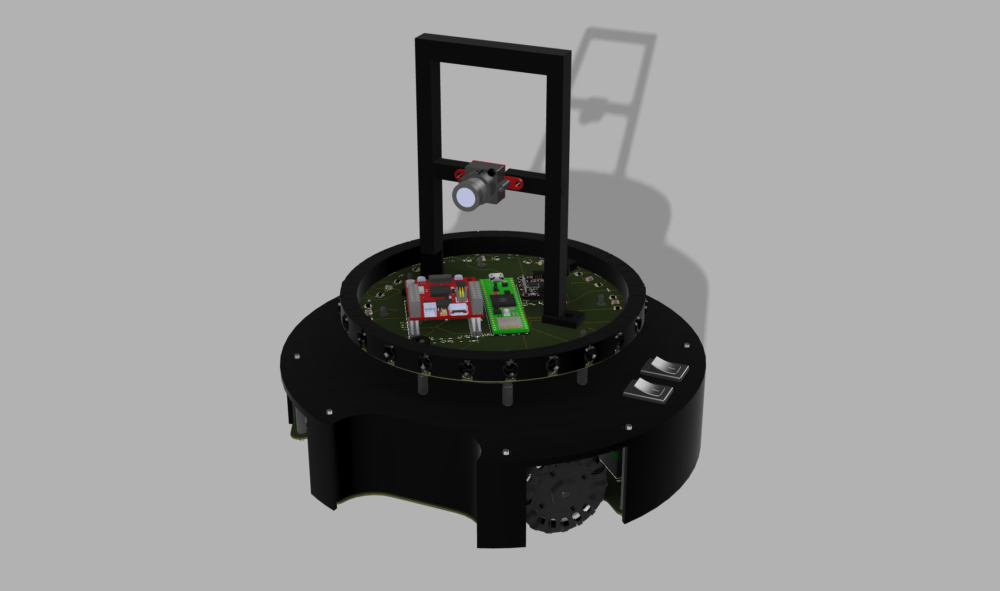

<h1 align="center" id="title">Robocup Soccer</h1>

A Lightweight Soccer Robot for Robocup Junior. Created by Matteo Cericola, John Qing, Sean Yien and Yuan Yoshimi. 

Documentation: https://andys-geese-2024.readthedocs.io/en/latest/

RoboCup is an international robotics tournament held around the world every year. More information can be found here: https://www.robocup.org/. The tournament we participated in this year was RoboCup Junior Lightweight.

<h2>Competition and Awards</h2>

2024 RCJ National Soccer Champion (Toronto)

2024 RCJ Regional Soccer Champion (Montreal)

2024 RCJ Regional Soccer Super Team Champion (Montreal)

<h2>3D Model Link</h2>

[https://a360.co/3x0yv2s](https://a360.co/3x0yv2s)

<h2>Project Pictures:</h2>

 
  
  
<h2>💻 Built with</h2>

Technologies used in the project:

*   Fusion 360
*   VS Code (PlatformIO)
*   Prusa MK4 3D Printer
*   Teensy 4.1
*   OpenMv Camera
*   Adafruit BNO085 Compass
*   TSSP4038
*   GTF 50mm Omniwheels
*   GA25YN370 12V 1000RPM Motors
*   Pololu G2 High-Power Motor Driver 18v25
*   Photodiodes
