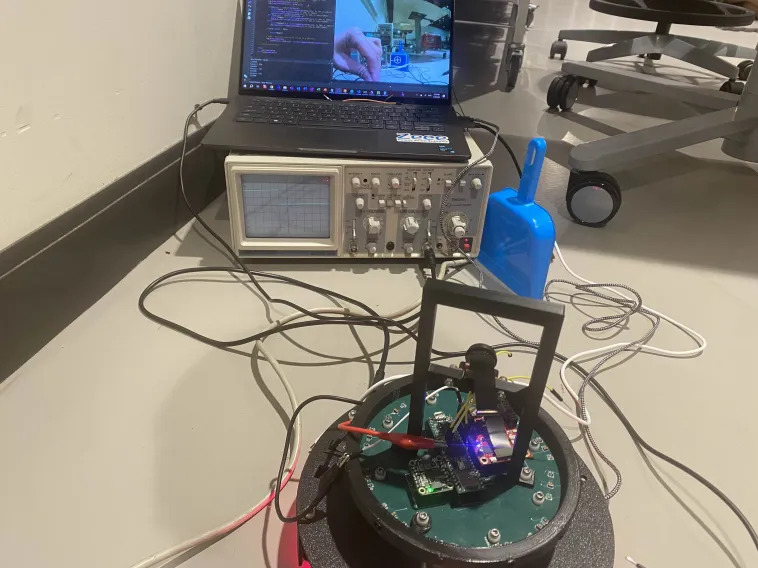

.. _OpenMV:
OpenMV
======

Camera Detection
----------------

`GitHub <https://github.com/YuanYoshimi/RCJ-Soccer-Robot>`_

Camera detection is accomplished with an onboard library from OpenMV. Originally, we were faced with an issue with incompatibility. The pyb micropython library, which was originally intended for use with the stm32 microprocessor found on the OpenMV H7 was no longer usable with the i.MX RT1062 microprocessor on the OpenMV RT1062. Thus, we had to improvise our communication and detection systems.

**Detection**

The sensor object is still usable with the new microprocessor, so we were able to access the blob class. This class, combined with colorr thresholds, was able to identify the goals given their unique colors.
::

    thresholds = [
       (72, 90, -4, 36, 24, 48),
       (14, 33, -11, 10, -47, -12)
    ]

    blobs = img.find_blobs(thresholds, pixels_threshold=200, area_threshold=200)

This formulates the base of our detection capabilities. However, the camera can still see over the top of the field, so there may be some issues such as detection of blue and yellow shirts and non-game objects. Thus, we limit the detection area to under the halfway point and only identify the largest blob.
::
    if blobs:
        largest = blobs[0]
        for blobsss in blobs:
            if blobsss.area() > largest.area():
                largest = blobsss
    blob = largest
        if blob.cy() > (240/2)+20:
            # These values depend on the blob not being circular - otherwise they will be shaky.
            if blob.elongation() > 0.5:
                img.draw_edges(blob.min_corners(), color=(255, 0, 0))
                img.draw_line(blob.major_axis_line(), color=(0, 255, 0))
                img.draw_line(blob.minor_axis_line(), color=(0, 0, 255))
            # These values are stable all the time.
            img.draw_rectangle(blob.rect())
            img.draw_cross(blob.cx(), blob.cy())

            if blob.cx() < (320/2)-bufferVal:
                print("Left: " + str(int(maptrans(blob.cx(), 0, 320, 0, 250))))
                print(int(maptrans(blob.cx(), 0, 320, 0, 250)))
                pwm.duty_ns(int(maptrans(blob.cx(), 0, 320, 0, 250))*1000)
            elif blob.cx() > (320/2)+bufferVal:
                print("Right: " + str(int(maptrans(blob.cx(), 0, 320, 0, 250))))
                pwm.duty_ns(int(maptrans(blob.cx(), 0, 320, 0, 250))*1000)
            else:
                print("Center: " + str(int(maptrans(blob.cx(), 0, 320, 0, 250))))
                pwm.duty_ns(int(maptrans(blob.cx(), 0, 320, 0, 250))*1000)

            if blob.area() > 8000:

                print("Near")

            # Note - the blob rotation is unique to 0-180 only.
            img.draw_keypoints(
                [(blob.cx(), blob.cy(), int(math.degrees(blob.rotation())))], size=20
            )
        #print(clock.fps())

    else:
        pwm.duty_ns(500000)
    print(pwm.duty_ns())

**Communication**

You will notice that part of the previously created code also includes the communication protocol. Although originally we were planning on using SPI for communication, the difficulty of slaving the OpenMV camera for data transfer so that both SCK pins would not attempt to simultaneously drive the clock signal resulted in us attempting a different approach:
::
    from machine import PWM
    from machine import Pin
    
    p = Pin("P3", Pin.OUT)

    pwm = PWM(p, 1000)

This sets up a PWM object given by the OpenMV library for use with pins on the RT1062. By modifying the duty cycle %, we can send a pulse with a different width. We decided to use this width, measuring in microseconds, to transfer our data.

We began by mapping (see API reference :py:func:`maptrans`) the x pixel value that we get a value from 0-250 that we send in the PWM signal. When there is no goal detected, we will send a PWM signal of 500.
::
    def maptrans(num, inMin, inMax, outMin, outMax):
        return outMin + (float(num - inMin) / float(inMax - inMin) * (outMax - outMin))

Then, we can adjust the width of the pulse (duty cycle %) with `pwm.duty_ns <https://docs.openmv.io/library/machine.PWM.html>`_

This way, when read from the Teensy, we can just use pulseIn().
::
    int val = pulseIn(10, HIGH, 1000);
    if (val>0){
        Serial.println(val);
    }

A value of 1000 for the timeout is required since the width of the pulses are hundreds of microseconds, so we must have 1000 µs as a timeout time in order to catch the entire pwm signal rather than parts of a pwm signal.

The resulting square wave is visible on an oscilloscope. Thus we can be assured that the signal is indeed being produced when degbugging.

API Reference
-------------

.. py:function:: maptrans(num, inMin, inMax, outMin, outMax)

    Translate/map a value from one range to another range.

    :param num: The number to be translated.
    :param inMin: The minimum of the input range.
    :param inMax: The maximum of the input range.
    :param outMin: The minimum of the output range.
    :param outMax: The maximum of the output range.
    :type num: int, float
    :type inMin: int, float
    :type inMax: int, float
    :type outMin: int, float
    :type outMax: int, float
    :return: The value from the original range mapped to the equivalent value of the new range.
    :rtype: int