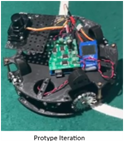
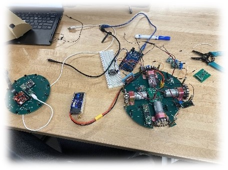
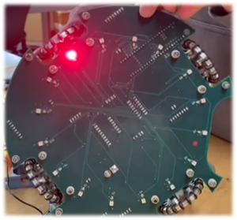

.. _dp:

Design Process
==============

Our robot has undergone many iterations since the first protype design. However, we maintained a similar basic functionality all throughout. We identified the need for robot movement, orientation and ball detection as the required base functionality and therefore the highest priority to complete. As such, the first prototype iteration of the robot to explore these technologies included these three aspects of RCJ Soccer. The image to the right illustrates the prototype iteration of our robot, with the Modern Robotics IR Locator 3601, the Progressive Automations MultiMoto Arduino Shield with 4 H-Bridges2, a CMPS-123 (with BNO055 IC), and an Arduino Mega4 as the processor.

The next iteration of the robot, the Regional Competition Iteration, we replaced multiple components and introduced the use of printed circuit boards to facilitate the transfer of data, as well as to provide a solid base and electrical pathways for the power supply. We also introduced the use of a 5V and a 3.3V step-down regulator in order to feed proper voltages to the new Teensy 4.1, BNO085, and ADG732 (referred to internally as the MuxBreakout). The image on the left shows all components mounted on both the top and bottom PCBs.

We stopped using the IR Locator 360 due to the unreliability as well as the halted production of the component. Instead, we opted for an IR Ring that employed the use of the TSSP4038, an IR receiver produced by Vishay. We also created a line sensor array with a colour sensor photodiode from Advanced Photonix, the 019-141-411-R SMD photodiode. The first iteration of the line sensor array used the OSRAM LS G6SP.02 SMD LED5 (see footnotes for reasons we no longer use this component). An OpenMV RT1062 was also mounted on the IR Ring and connected using extension cables to the mounting position on the handle of the robot.

The final iteration of the robot, the World Competition Iteration, involved all of the previous capabilities, with improvements to several systems and components. The bottom PCB had some fixes for mistakes on previous boards, different components, and filleted edges. Some problems with the MuxBreakout were also fixed, like a misplaced trace that was not caught by the DRC in Fusion 360 Electronics. All the printed circuit boards were switched to black, in order to minimize disruption to the IR sensors from reflected IR signatures.

The IR PCB was heavily modified. The sensor array was changed to 24 sensors, with 12 of them using a low-pass filter to convert the reading to an analog voltage based off distance, then read through the ADC (Analog to Digital Converter) on the Teensy 4.1 mounted on the IR Ring and the other 12 being directly read from the digital pins of the Teensy 4.1 by measuring the length of the pulses. This pulse measurement system will be explained further in the electronics section. The camera’s communication system was also switched over to SPI, to account for the difficulty in opening more than two serial ports on the Teensy 4.1. This will be discussed further in the technical sections.

Our game strategy was primitive in the Prototype Iteration. The only objective was for the robot to move forwards when the ball was directly in front. There was a BNO055 to do some adjustments, in case the robot ever stopped pointing forwards. The robot could not detect lines (see below) and would regularly violate the rules in search of the ball.

As you can see, the non functioning LEDs resulting in our color sensors being unusable.

The game strategy for the Regional Competition Iteration was slightly more complex, using a better BNO085 to adjust for angle, as well as a camera to aim for the goal. The new motor drivers allowed for more accurate motor speed control. However, some issues with the first LED generation caused the line sensors to malfunction, leading to an inability to control our robot’s movements within boundaries.

Finally, the game strategy for the Worlds Competition Iteration was much more complex. The angle correction featured a PID controller in order to prevent overturning and subsequently overturning again on the correction turn when the robot was wildly rocked out of control. We also identified five variables that we must always account for during the game. These were: ball angle (relative to the robot’s direction), ball distance (relative to the robot), robot direction, robot x (relative to the starting point), robot y (relative to the starting point). With these, we can perform PID again on the values to accurately move behind the ball and direct it to the goal with the help of the mounted camera. The values would work in tandem to the line sensors, which could provide an update to the x and y positions to account for any drift in the accelerometer.
