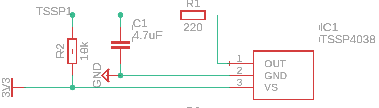
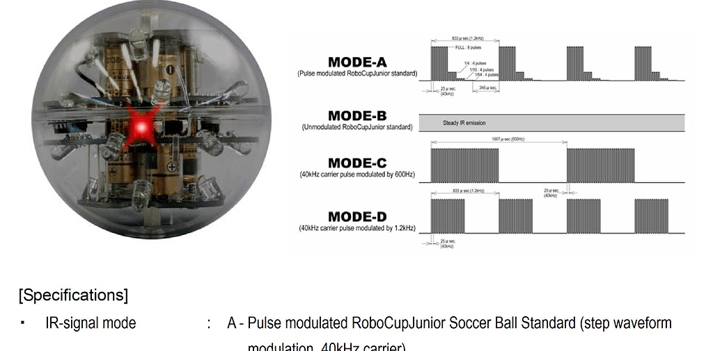
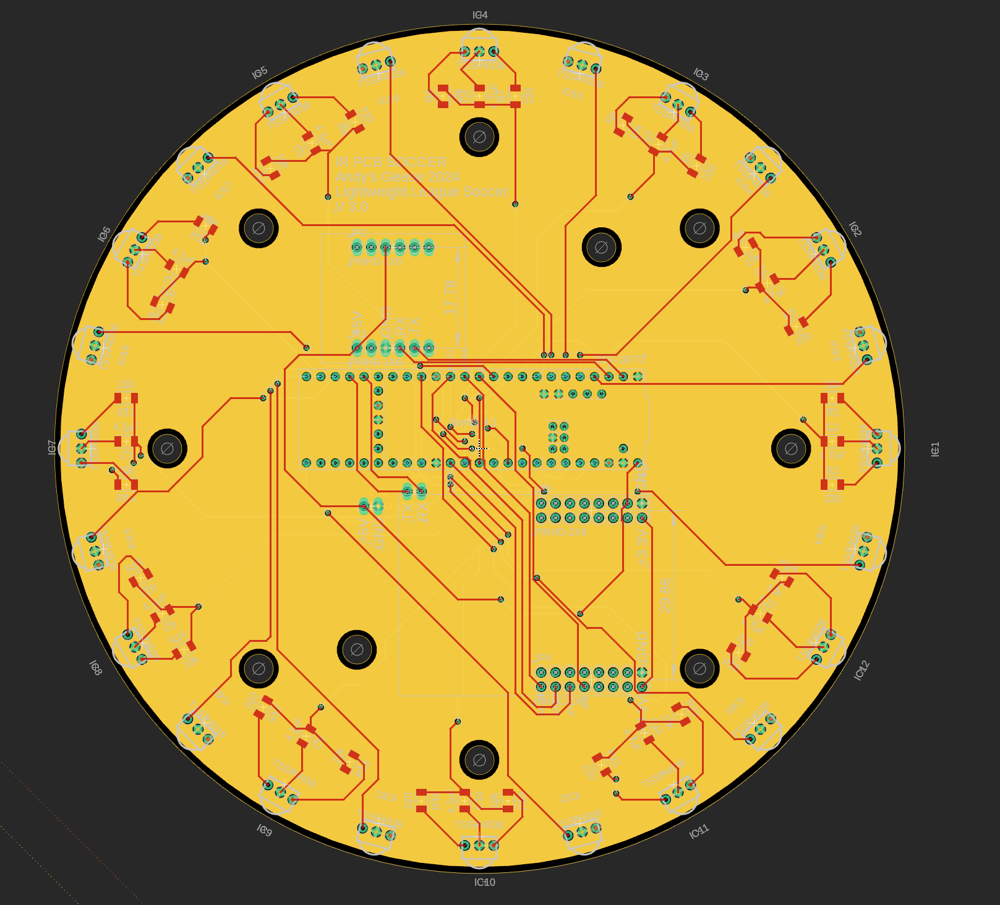

.. _irsensors:

Infrared Sensors
================

The Infrared Sensors we used this year corresponded with the popular choices among past `competitions <https://github.com/robocup-junior/awesome-rcj-soccer?tab=readme-ov-file>`_.

We used the TSSP4038, which was a popular choice for IR detectors. We ordered ours from Mouser, but there are many other distributors who sell the TSSP4038.

`Datasheet <https://www.vishay.com/docs/82458/tssp40.pdf>`_

Initially, we had first experimented with the data output. Our oscilloscope indicated that the output was essentially a square wave. We did not understand the intensities at this point in time, so we placed a low-pass filter on it in order to read the square wave value as an analog input.

After playing around with the capacitor and resistor values as well as adding a pull up resistor, we were able to achieve a circuit with reasonable output on a breadboard. In later PCB designs, we used the same circuitry depicted in the schematic excerpt below:

However, as specified by datasheets and online, the output of the IR ball is quite a bit more complicated than what we saw with this simple circuit.

The ball outputs a stepped waveform of different groups of intensity. That means the ball will pulse at different intensities for a certain amount of times. This is depicted in the diagram below (Mode A since that is what is used in the international competition):

Thus, the dropping intensity near the end of the cycle means the further you are from the ball, the less you can see. Naturally, when light intensity drops below a certain threshold, the receivers can no longer distinguish between the ball's light and the ambient light. Therefore, the receiver no longer perceives the lower intensities the further away you move. This means that every time we move out of range of one intensity, the length of the square wave changes. And by sampling for this length, we can determine the distance from the ball, up to a resolution of approximately 5 different distances.

One might now ask, "how would I sample this distance"? Well, for one, pulseIn() on arduino works perfectly fine. What pulseIn() does is measure the length of a digital signal's state that it stays in. So if we connect both the grounds of the arduino (or other arduino avr board) and the receiver (this allows us to work with a common logic signal) and connect the output of the previously mentioned IR receiver, we can just directly pulseIn() to get the length of the pulse.

The code for this is really quite simple, an example is shown (assuming your IR output is connected to pin 1):
::
    //connections:
    //IR Receiver Out -> Digital Pin 1
    //IR Receiver GND -> Board Ground (This syncs their logic base level)
    //IR Receiver VCC -> Read datasheet for appropriate voltage.
    void setup()
    {
        pinMode(1, INPUT);
    }

    void loop()
    {
        int length = pulseIn(1, HIGH, 500); //note that we are reading HIGH, which means that we are looking for the length of the pulse when it is above logic low (logic ground)
    }

Alternatively, the option of using a low pass filter exists. This is because when we move out of an intensity's range, we no longer detect the pulses at that intensity. Therefore, the low pass filter will turn the wave into a lower analog signal, due to the decreased length of the wave.

Both work well, but the low pass filter method is easier if you have a slower MCU, since pulseIn() may not be accurate if your MCU clock speed is too low.

We adapted both low pass and pulseIn() for our PCB design, shown below (also found on our GitHub).

